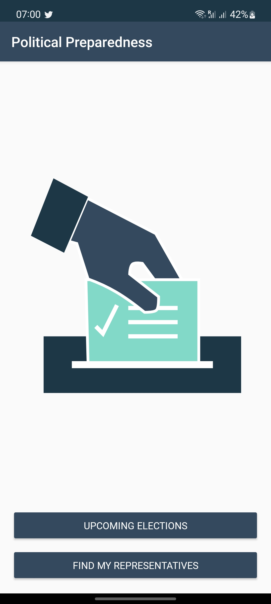
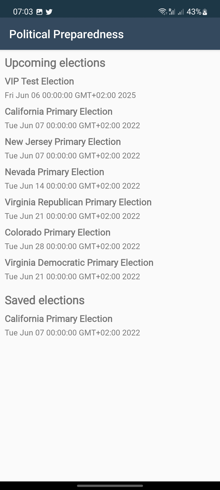
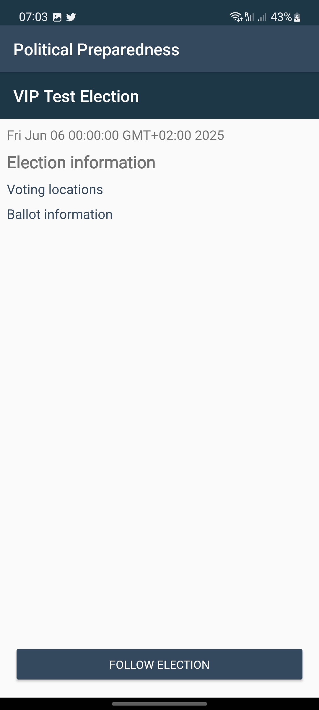
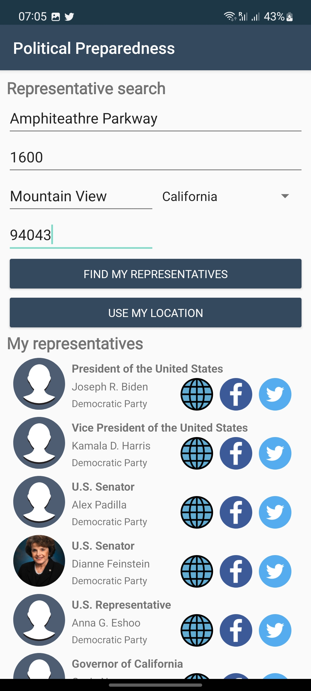
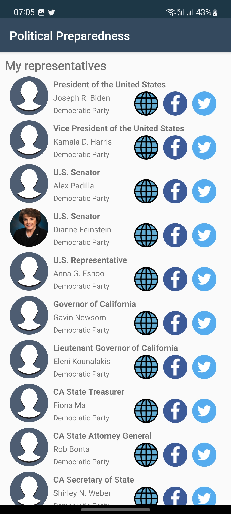

# Political Preparedness

Political Preparedness is an example application built to demonstrate core Android Development skills as presented in the Udacity Android Developers Kotlin curriculum.

This app demonstrates the following views and techniques:

- [Retrofit](https://square.github.io/retrofit/) to make api calls to an HTTP web service.
- [Moshi](https://github.com/square/moshi) which handles the deserialization of the returned JSON to Kotlin data objects.
- [Glide](https://bumptech.github.io/glide/) to load and cache images by URL.
- [Room](https://developer.android.com/training/data-storage/room) for local database storage.

It leverages the following components from the Jetpack library:

- [ViewModel](https://developer.android.com/topic/libraries/architecture/viewmodel)
- [LiveData](https://developer.android.com/topic/libraries/architecture/livedata)
- [Data Binding](https://developer.android.com/topic/libraries/data-binding/) with binding adapters
- [Navigation](https://developer.android.com/topic/libraries/architecture/navigation/) with the SafeArgs plugin for parameter passing between fragments

## Getting Started

To get started with this project, simply pull the repository and import the project into Android Studio. From there, deploy the project to an emulator or device.

- NOTE: In order for this project to pull data, you will need to add your API Key to the project as a value in the CivicsHttpClient. You can generate an API Key from the [Google Developers Console](https://console.developers.google.com/)

### Dependencies

```
// Kotlin
implementation "org.jetbrains.kotlin:kotlin-stdlib-jdk7:$version_kotlin"
implementation "org.jetbrains.kotlinx:kotlinx-coroutines-core:$version_kotlin_coroutines"
implementation "org.jetbrains.kotlinx:kotlinx-coroutines-android:$version_kotlin_coroutines"
implementation "org.jetbrains.kotlinx:kotlinx-serialization-runtime:$version_kotlin_serialization"

// Constraint Layout
implementation "androidx.constraintlayout:constraintlayout:$version_constraint_layout"

// ViewModel and LiveData
implementation "androidx.lifecycle:lifecycle-extensions:$version_lifecycle_extensions"

// Navigation
implementation "androidx.navigation:navigation-fragment-ktx:$version_navigation"
implementation "androidx.navigation:navigation-ui-ktx:$version_navigation"

// Core with Ktx
implementation "androidx.core:core-ktx:$version_core"

// Retrofit
implementation "com.squareup.retrofit2:retrofit: $version_retrofit"
implementation "com.squareup.retrofit2:converter-moshi:$version_retrofit"
implementation "com.jakewharton.retrofit:retrofit2-kotlin-coroutines-adapter:$version_retrofit_coroutines_adapter"

// Moshi
implementation "com.squareup.moshi:moshi:$version_moshi"
implementation "com.squareup.moshi:moshi-kotlin:$version_moshi"
implementation "com.squareup.moshi:moshi-adapters:$version_moshi"

// Glide
implementation 'com.github.bumptech.glide:glide:4.13.0'
annotationProcessor 'com.github.bumptech.glide:compiler:4.13.0'

//Room
implementation "androidx.room:room-ktx:$version_room"
implementation "androidx.room:room-runtime:$version_room"
kapt "androidx.room:room-compiler:$version_room"

// Location
implementation "com.google.android.gms:play-services-location:$version_play_services_location"
```

### Screenshots





